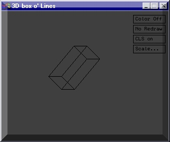



## A 3D box out of lines

### Description

This code will show you the basics of lines. In this example, I made it create a 3d box which you can rotate, scale, and move around. This may be considered 3D, but it is very basic!
 
### More Info
 

             |
---                |---
**Submitted On**   |2001-06-11 08:45:30
**By**             |[Tecc](https://github.com/Planet-Source-Code/PSCIndex/blob/master/ByAuthor/tecc.md)
**Level**          |Beginner
**User Rating**    |4.3 (17 globes from 4 users)
**Compatibility**  |VB 6\.0
**Category**       |[Graphics](https://github.com/Planet-Source-Code/PSCIndex/blob/master/ByCategory/graphics__1-46.md)
**World**          |[Visual Basic](https://github.com/Planet-Source-Code/PSCIndex/blob/master/ByWorld/visual-basic.md)
**Archive File**   |[A 3D box o210106112001\.zip](https://github.com/Planet-Source-Code/tecc-a-3d-box-out-of-lines__1-23992/archive/master.zip)

